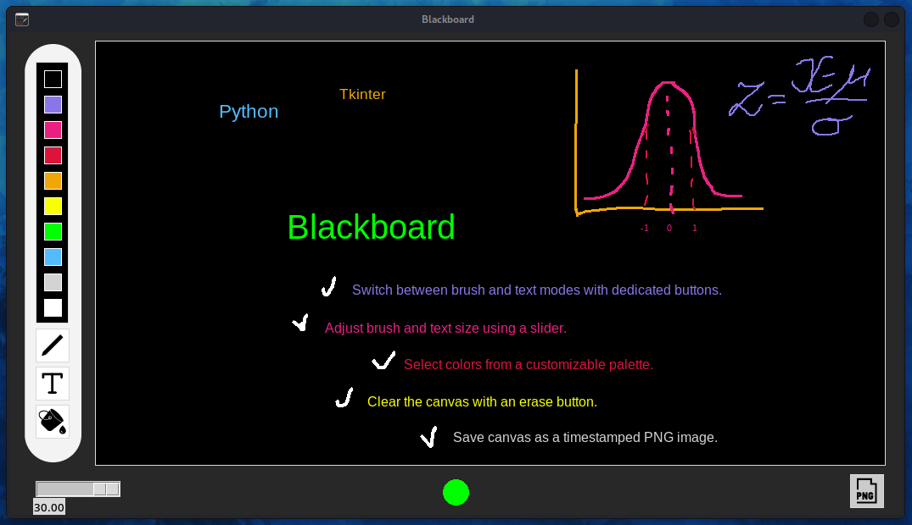

# Blackboard Application



This is a user-friendly blackboard application built with Tkinter in Python. It enables drawing and typing on a canvas with customizable colors, sizes, and modes.

## Author

Yauheniya

## Version

1.1.0

## Features

- Switch between drawing and typing modes
- Adjust brush and text size with a slider
- Select colors from a customizable palette
- Reset the canvas to clean black 
- Save canvas as a timestamped PNG image.

## Use Cases

The Blackboard application can be utilized in various scenarios, including:

1. **Teaching and Education**
   - Illustrate concepts during online classes
   - Create quick diagrams for explanations
   - Collaborative problem-solving with students

2. **Project Brainstorming**
   - Sketch out ideas during team meetings
   - Create mind maps for project planning
   - Visualize project workflows

3. **Remote Collaboration**
   - Share ideas visually during video calls
   - Explain concepts to remote team members
   - Collaborative ideation sessions

4. **Personal Note-Taking**
   - Jot down quick ideas or sketches
   - Create visual to-do lists
   - Draft rough designs or layouts

## Requirements

- Python 3.x
- Tkinter (usually included with Python)

## Installation

1. Clone the repository:
   ```sh
   git clone https://github.com/yauheniya-ai/Blackboard.git

2. Navigate to the project directory:
   `cd Blackboard`

## Usage

To run the Blackboard application:

1. Ensure you have Python installed on your system.
2. Open a terminal or command prompt.
3. Navigate to the project directory.
4. Run the following command:
   `python blackboard.py`

## Contributing

Contributions are welcome! Please feel free to submit a Pull Request.

## License

This project is licensed under the MIT License. See the [LICENSE](LICENSE) file in the project root for the full license text.
