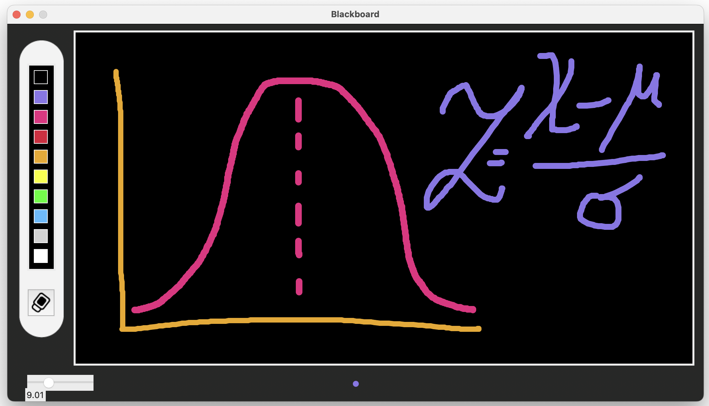

# Blackboard Application



This is a simple blackboard application built using Tkinter in Python. It allows users to draw on a canvas with different colors and brush sizes.

## Features

- Draw on a canvas with different colors
- Change brush size using a slider
- Clear the canvas with an eraser button
- Color palette for selecting different colors

## Requirements

- Python 3.x
- Tkinter (usually included with Python)

## Installation

1. Clone the repository:
   ```sh
   git clone https://github.com/yauheniya-ai/Blackboard.git
